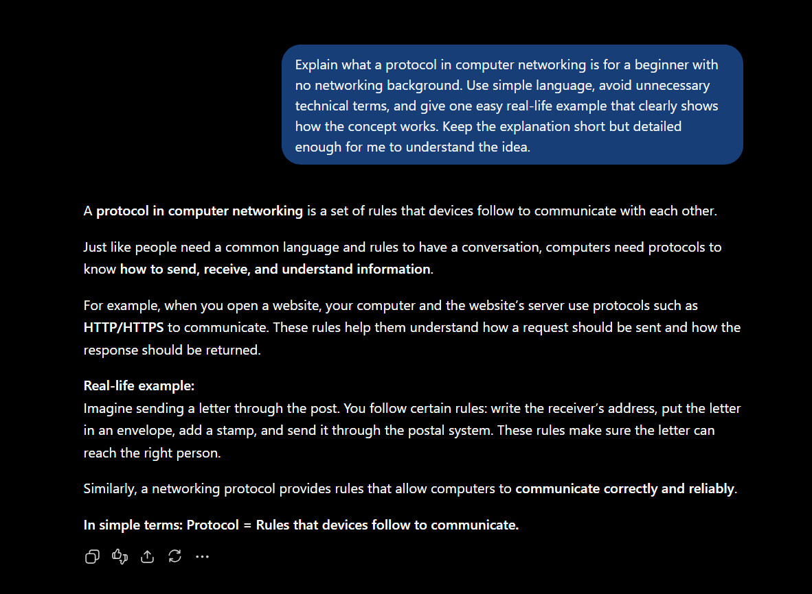
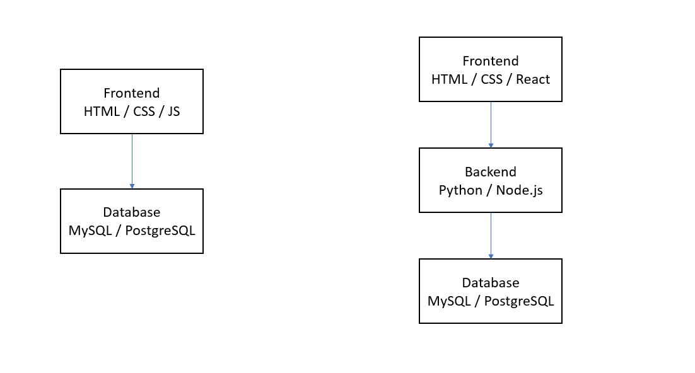
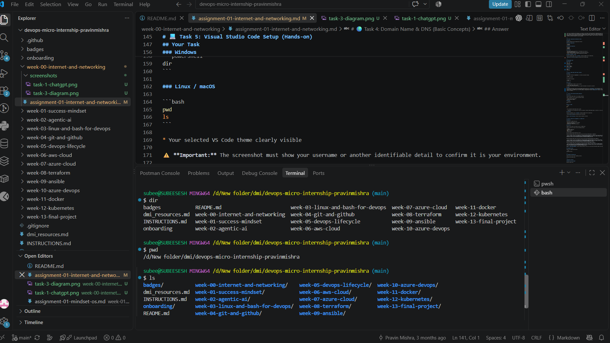

# Week 00 - Internet and Networking

Part of the DevOps Micro Internship (DMI) Cohort 3 with Agentic AI

---

# 🧑‍💻 Task 1: Using ChatGPT as Your Learning Assistant

## Scenario

You're new to DevOps and will frequently encounter technical questions. ChatGPT can be your learning companion.

## Your Task

Write a clear ChatGPT prompt to help you understand:

> "What is a protocol in networking? Explain with a simple real-life example."

Take a screenshot of your interaction showing:

* Your detailed prompt (with clear expectations)
* ChatGPT's simplified response with an example

## Screenshot




---

## What I Learned (2–3 lines)

I learned that a networking protocol is a set of rules that devices follow to communicate with each other. A simple example is how people follow rules while having a conversation so that both sides understand each other.


---

# 🌐 Task 2: Internet and Networking

## Scenario

Your friend is launching an online bookstore named **EpicReads**.

He asked you to explain how users globally can access his website hosted in Finland.

## Your Task

Write a short explanation (**100–150 words**) that includes:

* Packet Switching
* IP Address
* TCP/IP
* HTTP/HTTPS

💡 **Tip:** You may use ChatGPT (as demonstrated in Task 1) to refine your explanation.

## Answer
When a user anywhere in the world opens the EpicReads website, the request is divided into small pieces of data called packets. Packet switching allows these packets to travel across different networks and routes before reaching the server in Finland. The server has an IP address that identifies its location on the network. TCP/IP provides the communication rules that allow the user's device and the server to exchange data reliably across the Internet. When the user accesses EpicReads through a browser, HTTP or HTTPS is used to request and transfer web pages and other resources. HTTPS is the secure version of HTTP because it encrypts the communication between the user's browser and the website. Together, packet switching, IP addressing, TCP/IP, and HTTP/HTTPS allow users globally to access EpicReads.


---

# 🏗️ Task 3: Application Architecture & Stack

## Scenario

EpicReads bookstore has two application versions:

### Two-Tier Application

* Frontend
* Database

### Three-Tier Application

* Frontend
* Backend
* Database

## Your Task

* Draw simple diagrams (hand-drawn or tool-based such as draw.io)
* Label each layer clearly
* List at least two common technologies or tools used for each layer
* Submit a screenshot or photo clearly showing your own drawing

## Diagram Screenshot / Photo

Save your diagram image in the `screenshots` folder and update the file name below.




---

## Technologies Used

### Frontend

HTML / CSS
JavaScript / React

### Backend

Python / Django
Node.js / Express

### Database

MySQL
PostgreSQL

---

# 🌍 Task 4: Domain Name & DNS (Basic Concepts)

## Scenario

Your friend's bookstore **EpicReads** is currently accessible through:

```text
52.172.142.222:3000
```

He purchased the domain:

```text
epicreads.com
```

## Your Task

In **50–100 words**, explain in your own words:

1. What is DNS (Domain Name System)?
2. Which DNS record type should be used to connect the domain to the given IP, and why?

## Answer

DNS (Domain Name System) translates human-readable domain names such as `epicreads.com` into IP addresses that computers use to locate servers. For EpicReads, an **A record** should be used because the given address `52.172.142.222` is an IPv4 address. The A record connects the domain name to this IPv4 address, allowing users to enter `epicreads.com` instead of remembering the numerical IP address.


---

# 💻 Task 5: Visual Studio Code Setup (Hands-on)

## Your Task

Install Visual Studio Code (if not already installed).

Take a screenshot of your VS Code environment showing:

* Terminal open inside VS Code
* Running a basic command:

### Windows

```powershell
dir
```

### Linux / macOS

```bash
pwd
ls
```

* Your selected VS Code theme clearly visible

⚠️ **Important:** The screenshot must show your username or another identifiable detail to confirm it is your environment.

## Screenshot

Save your screenshot in the `screenshots` folder and update the file name below.




Replace `task-5-vscode.png` with your actual screenshot file name.

---

# 🔗 Task 6: Publish Your Assignment as a LinkedIn Post

## Objective

Publishing on LinkedIn helps you:

* Build your professional online presence
* Reinforce your learning
* Document your DevOps journey publicly

## Your Task

Summarize your answers from Tasks 1–5 into a LinkedIn post.

Clearly structure your post into the following sections:

* ChatGPT
* Internet & Networking
* App Architecture
* DNS
* VS Code Setup

Use the credit note that matches your track:

Add the following credit note at the end of your post **(If you are DMI Cohort 3 student)**:

> **P.S. This post is part of the DevOps Micro Internship (DMI) with Agentic AI — Cohort 3 — by Pravin Mishra. My graded progress is public: https://dmi.pravinmishra.com/s/YOUR-GITHUB-USERNAME.html · Start your DevOps journey: https://dmi.pravinmishra.com/?utm_source=student&utm_medium=ps-linkedin&utm_campaign=cohort3**


Add the following credit note at the end of your post **(If you are DMI Self-paced track student)**:

> **P.S. This post is part of the DevOps Micro Internship (DMI) — Self-Paced Engineer Track — by Pravin Mishra. My graded progress is public: https://dmi.pravinmishra.com/s/subeesesh.html · Start your DevOps journey: https://dmi.pravinmishra.com/?utm_source=student&utm_medium=ps-linkedin&utm_campaign=self-paced**

Add the following credit note at the end of your post **(If you are DMI Campus student)**:

> **P.S. This post is part of the DevOps Micro Internship (DMI) — Campus — by Pravin Mishra. My graded progress is public: https://dmi.pravinmishra.com/s/subeesesh.html · Start your DevOps journey: https://dmi.pravinmishra.com/?utm_source=student&utm_medium=ps-linkedin&utm_campaign=campus**

Replace `YOUR-GITHUB-USERNAME` with your GitHub username — that link is your public DMI progress page (your graded badge page).
---

## LinkedIn Post URL

Paste your LinkedIn post URL here:

```text
https://lnkd.in/p/gABpxHBK
```

---

## LinkedIn Post Backup Copy

Paste the full text of your LinkedIn post here:

🚀 𝐖𝐞𝐞𝐤 𝟎0 𝐨𝐟 𝐭𝐡𝐞 𝐃𝐞𝐯𝐎𝐩𝐬 𝐌𝐢𝐜𝐫𝐨 𝐈𝐧𝐭𝐞𝐫𝐧𝐬𝐡𝐢𝐩 (𝐃𝐌𝐈) — 𝐂𝐨𝐡𝐨𝐫𝐭 𝟑

This week was different from a typical technical assignment.

Instead of focusing on a new tool, framework, or programming concept, I spent time understanding something more fundamental — **how I think, learn, work, and approach my long-term career growth.**

The focus of Week 01 was building my personal **“Mindset OS”** — a system that I can use throughout the next five months of DMI and beyond.

𝐀 𝐟𝐞𝐰 𝐢𝐦𝐩𝐨𝐫𝐭𝐚𝐧𝐭 𝐭𝐡𝐢𝐧𝐠𝐬 𝐈 𝐥𝐞𝐚𝐫𝐧𝐞𝐝:

🔹 **Practice exposes gaps that theory can hide.**
While learning programming and SQL, I realized that understanding an explanation does not always mean I can apply the concept independently. Writing code, solving problems, making mistakes, and fixing them gave me a much deeper understanding.

🔹 **Complex problems become manageable when broken into smaller problems.**
Technical areas such as AI, DevOps, Cloud, and software development can initially feel overwhelming. Breaking them into smaller concepts makes it easier to understand, practice, and eventually connect everything together.

🔹 **Proof of work matters.**
I realized that knowing a concept is more valuable when I can demonstrate it through practical work. Projects, GitHub contributions, documentation, deployments, and technical writing can provide evidence of what I have actually learned.

One belief I reflected on this week is that **AI will significantly change traditional software development.** I don't think developers will disappear completely, but I believe the role will evolve. Developers who understand systems, architecture, DevOps, AI, business problems, and AI-assisted development may become increasingly important.

I also created a **5-month personal system** around programming, SQL, DevOps, Cloud, DMI activities, focused learning, projects, health, and financial awareness.

One weakness I identified is my tendency to sometimes try to understand too much at once. My approach going forward is to break complex topics into smaller objectives and focus on one concrete task at a time.

My system for the coming months is simple:

**Learn → Practice → Build → Document → Review → Repeat.**

My goal is not just to consume more information. I want my learning to produce **real projects, practical experience, GitHub activity, documentation, and measurable progress.**

This is only Week 01, but I am treating it as the foundation for the next stage of my learning journey.

Looking forward to the upcoming weeks and the challenges ahead. 🚀

#DevOps #DMI #DMI2026 #AgenticAI #CloudComputing #SoftwareDevelopment #AI #LearningJourney #ContinuousLearning #CareerGrowth #GitHub #TechCareer

P.S. This post is part of the DevOps Micro Internship (DMI) with Agentic AI — Cohort 3 — by Pravin Mishra. My graded progress is public: https://dmi.pravinmishra.com/s/subeesesh.html


---

# Reflection – Week 0

### What did you find easy?

I found the basic concepts of IP addresses, domains, and application layers relatively easy to understand once I connected them with real-world examples. Setting up and using VS Code was also straightforward because I could immediately see the results of the commands I ran.

### What was difficult?

Understanding how different networking concepts work together was more difficult than learning each definition separately. Concepts such as packet switching, TCP/IP, HTTP/HTTPS, and DNS are connected, so understanding the complete flow required looking at them as parts of the same system.

### What will you improve next week?

Next week, I will focus more on understanding concepts through practical examples instead of only memorizing definitions. I will also try to document what I learn and create proof of work as I progress.


---

## 📌 About DMI & CloudAdvisory

DevOps Micro Internship (DMI) is a project-based DevOps program run by Pravin Mishra (The CloudAdvisory) focused on real-world execution, systems thinking, and career readiness.

It helps learners build strong DevOps foundations with hands-on experience.


## 📌 Resources

- 🌐 **DMI Official Website:** https://dmi.pravinmishra.com?utm_source=github&utm_medium=readme  
- 🎓 **University:** https://university.pravinmishra.com?utm_source=github&utm_medium=readme  
- 💬 **Discord Community:** https://discord.pravinmishra.com?utm_source=github&utm_medium=readme  
- 📝 **Blog:** https://dmi.pravinmishra.com/blog?utm_source=github&utm_medium=readme  
- ▶️ **YouTube Playlist (DMI Cohort 3):** https://www.youtube.com/playlist?list=PLFeSNDtI4Cho  
- 🔗 **Pravin Mishra (LinkedIn):** https://www.linkedin.com/in/pravin-mishra-aws-trainer/  
- 🏢 **CloudAdvisory (LinkedIn):** https://www.linkedin.com/company/thecloudadvisory/

---

*This submission is part of DevOps Micro Internship (DMI) Cohort 3 — Agentic AI Track*
